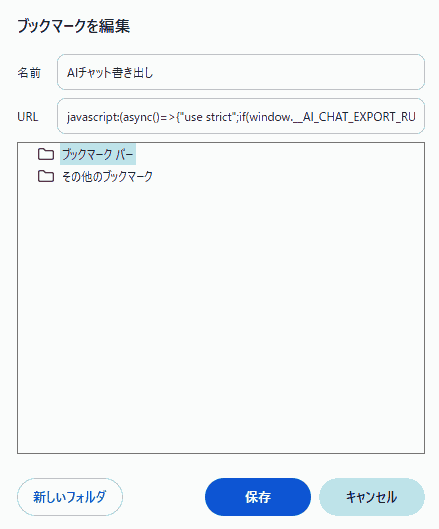
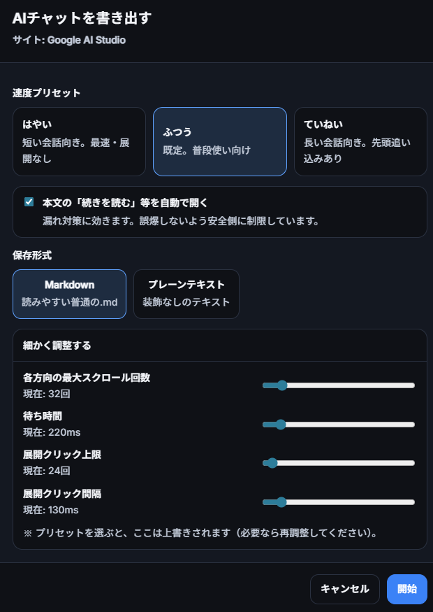
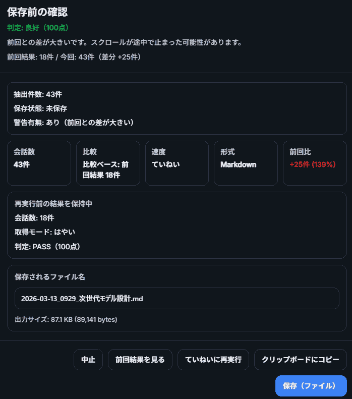

# AI Chat Export

[Japanese README](README.ja.md) | [Chinese README](README.zh-CN.md)

A bookmarklet that saves conversations from Claude, ChatGPT, Grok, Google AI Studio, and similar sites directly from the browser.

## Why this tool exists

Long AI chats are hard to preserve cleanly. Infinite scroll, collapsed content, and partial copy operations often leave gaps.

This tool is built to collect the conversation as safely as possible and export it in a format that is easy to keep locally.

- Capture long AI chats in one pass
- Keep user and model turns readable
- Convert to Markdown or Plain text
- Run a quality check before saving so you can spot likely misses

## Key features

- Runs as a bookmarklet. No browser extension is needed
- Built-in adapters for Claude, ChatGPT, Grok, and Google AI Studio
- Auto-scrolls toward both the top and bottom of long conversations
- Auto-clicks expansion buttons such as `Show more`
- Exports in `Markdown` or `Plain text`
- Shows a quality check before saving
- Can save to a file or copy to the clipboard
- Remembers your mode and format in the browser

## Recommended files

- `ai-chat-export.chrome.bookmarklet.oneliner.js`
  - One-file version for Chrome / Chromium
- `ai-chat-export.firefox.bookmarklet.oneliner.js`
  - Smaller one-file version for Firefox
  - Uses a compact result screen so it fits Firefox bookmark limits better

## How it looks

### Bookmark setup



Paste the file content into the bookmark URL field in Chrome or another Chromium browser.

### Run settings



Choose a mode and a save format before starting.

### Export result



Even long conversations can be saved as readable Markdown.

## Quick start

1. Open `ai-chat-export.chrome.bookmarklet.oneliner.js` for Chrome / Chromium or `ai-chat-export.firefox.bookmarklet.oneliner.js` for Firefox
2. Copy the whole file content into a browser bookmark URL field
3. Open a supported conversation page and run the bookmarklet
4. Choose the run mode and save format in the dialog
5. Review the quality check and save

## What it is good for

- Conversations you want to revisit later as Markdown
- Conversations you want to share quickly as Plain text
- Long chats where manual copy tends to miss or duplicate content

## Output formats

- `Markdown`
  - Best when you want a normal `.md` file
- `Plain text`
  - Lightweight export with most Markdown formatting removed

Plain text can be exported with or without the conversation header.

## Run modes

- `Fast`
  - For short conversations
- `Normal`
  - Default. Best for everyday use
- `Careful`
  - For long conversations. Tries harder to load everything

## Quality status

The tool shows `PASS` / `WARN` / `FAIL` before saving. If a long conversation reports `WARN` or `FAIL`, rerunning in `Careful` mode is usually the best next step.

## Supported sites

- `chatgpt.com` / `chat.openai.com`
- `claude.ai`
- Grok domains and `x.com/i/grok`
- `aistudio.google.com`
- Some `gemini` / `deepseek` domains

## Repository layout

- `ai-chat-export.chrome.bookmarklet.oneliner.js`
  - ASCII-based one-file version for Chrome / Chromium
- `ai-chat-export.firefox.bookmarklet.oneliner.js`
  - ASCII-based smaller one-file version for Firefox
- `src/ai-chat-export.js`
  - Readable source

## Detailed docs

- [docs/index.md](docs/index.md)
- [docs/index.zh-CN.md](docs/index.zh-CN.md)

## Development notes

Regenerate the one-liner files:

```bash
bash scripts/generate_oneline_bookmarklet.sh
```

Sync `docs/` assets:

```bash
bash scripts/sync_docs_assets.sh
```

## License

Apache License 2.0
